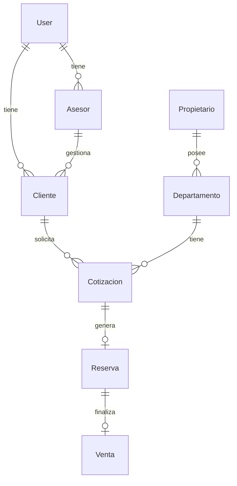

# 📊 ANÁLISIS TÉCNICO Y ESTRUCTURAL DEL SISTEMA INMOBILIARIO

## 📑 RESUMEN EJECUTIVO

Este documento presenta un análisis técnico detallado del sistema inmobiliario implementado con Laravel 12, React 18 y Inertia.js. El análisis abarca la arquitectura, estructura de datos, implementación actual y recomendaciones de mejora.

## 🏗️ ANÁLISIS DE ESTRUCTURA ACTUAL

### 1. Arquitectura del Sistema

#### 1.1 Stack Tecnológico
- **Backend:** Laravel 12 + PHP 8.2+
- **Frontend:** React 18 + Inertia.js
- **Base de Datos:** MySQL 8.0+
- **Testing:** PHPUnit + MySQL Testing
- **Build Tools:** Vite + PostCSS
- **Autenticación:** Laravel Sanctum
- **CSS Framework:** Tailwind CSS

#### 1.2 Patrón Arquitectónico
```
┌─────────────────────────────────────────────┐
│                  CLIENTE                    │
│        React 18 + Inertia.js + SPA         │
├─────────────────────────────────────────────┤
│               CONTROLADORES                 │
│          Admin / Asesor / Cliente          │
├─────────────────────────────────────────────┤
│              CAPA DE NEGOCIO               │
│         Servicios + Validaciones           │
├─────────────────────────────────────────────┤
│             CAPA DE DATOS                  │
│        Modelos Eloquent + MySQL            │
└─────────────────────────────────────────────┘
```

### 2. Estructura de Carpetas

#### 2.1 Estructura Principal
```
inmobiliaria/
├── app/
│   ├── Console/Commands/        # Comandos CLI
│   ├── Http/                   # Controladores y Middleware
│   ├── Models/                 # Modelos Eloquent
│   ├── Policies/              # Políticas de autorización
│   ├── Providers/             # Service Providers
│   └── Services/              # Servicios de negocio
├── config/                    # Configuraciones
├── database/                  # Migraciones y seeders
├── public/                    # Archivos públicos
├── resources/                 # Assets y vistas
├── routes/                    # Definición de rutas
└── tests/                     # Pruebas unitarias
```

### 3. Análisis de Base de Datos

#### 3.1 Modelos Principales


#### 3.2 Tablas Principales y Relaciones

##### 3.2.1 Users
```sql
- id (PK)
- name (string)
- email (unique)
- role (enum: admin, asesor, cliente)
- telefono (nullable)
- estado (enum: activo, inactivo)
- email_verified_at
```

##### 3.2.2 Asesores
```sql
- id (PK)
- usuario_id (FK → users)
- fecha_contrato
- documento
- especialidad
- comision_porcentaje
```

##### 3.2.3 Clientes
```sql
- id (PK)
- usuario_id (FK → users)
- asesor_id (FK → asesores)
- dni
- preferencias (json)
- estado (enum)
```

##### 3.2.4 Departamentos
```sql
- id (PK)
- codigo (unique)
- titulo
- precio
- estado (enum)
- propietario_id (FK)
```

### 4. Análisis de Rutas y Controladores

#### 4.1 Estructura de Rutas
```
routes/
├── web.php           # Rutas web principales
├── api.php           # Endpoints API REST
├── auth.php          # Rutas de autenticación
└── console.php       # Comandos de consola
```

#### 4.2 Grupos de Rutas Principales

##### 4.2.1 Rutas Públicas
```php
/                   # Redirección a catálogo
/catalogo           # Listado público
/catalogo/{id}      # Detalle de propiedad
/login              # Autenticación
/register           # Registro
```

##### 4.2.2 Rutas de Admin
```php
/admin/dashboard
/admin/usuarios
/admin/departamentos
/admin/ventas
/admin/reportes
```

##### 4.2.3 Rutas de Asesor
```php
/asesor/dashboard
/asesor/clientes
/asesor/cotizaciones
/asesor/reservas
```

##### 4.2.4 Rutas de Cliente
```php
/cliente/dashboard
/cliente/favoritos
/cliente/solicitudes
/cliente/cotizaciones
```

### 5. Análisis de Seguridad

#### 5.1 Autenticación
- ✅ Laravel Sanctum implementado
- ✅ Middleware de autenticación
- ✅ Verificación de email
- ✅ Reset de contraseña

#### 5.2 Autorización
- ✅ Roles definidos (admin, asesor, cliente)
- ✅ Políticas de acceso basadas en roles
- ✅ Middleware de verificación de roles

#### 5.3 Validación
- ✅ Validación de formularios
- ✅ Sanitización de inputs
- ✅ CSRF protection

### 6. Sistema de Testing

#### 6.1 Tests Implementados
```
tests/
├── Feature/
│   ├── Auth/           # Tests de autenticación
│   ├── Admin/          # Tests de admin
│   ├── Asesor/         # Tests de asesor
│   └── Cliente/        # Tests de cliente
└── Unit/
    ├── Models/         # Tests de modelos
    └── Services/       # Tests de servicios
```

#### 6.2 Factories
```php
database/factories/
├── UserFactory.php
├── AsesorFactory.php
├── ClienteFactory.php
├── DepartamentoFactory.php
├── CotizacionFactory.php
├── ReservaFactory.php
└── VentaFactory.php
```

### 7. Análisis de Frontend

#### 7.1 Estructura React/Inertia
```
resources/js/
├── Pages/
│   ├── Admin/          # Vistas de admin
│   ├── Asesor/         # Vistas de asesor
│   ├── Cliente/        # Vistas de cliente
│   └── Public/         # Vistas públicas
├── Components/         # Componentes reutilizables
└── Layouts/           # Layouts por rol
```

#### 7.2 Assets y Estilos
```
resources/
├── css/
│   └── app.css        # Estilos Tailwind
└── js/
    └── app.js         # Entry point
```

## 🔍 ANÁLISIS DE IMPLEMENTACIÓN ACTUAL

### 1. Funcionalidades Implementadas

#### 1.1 Sistema Base
- ✅ Autenticación multi-rol
- ✅ Registro de usuarios
- ✅ Gestión de perfiles
- ✅ Navegación básica

#### 1.2 Módulo Inmobiliario
- ✅ Catálogo de propiedades
- ✅ Gestión de departamentos
- ✅ Sistema de favoritos
- ✅ Búsqueda básica

### 2. Puntos Fuertes

1. **Arquitectura Sólida**
   - Separación clara de responsabilidades
   - Uso de patrones de diseño Laravel
   - Sistema de roles robusto

2. **Base de Datos Optimizada**
   - Relaciones bien definidas
   - Índices apropiados
   - Migraciones completas

3. **Testing Integral**
   - 26 pruebas unitarias
   - Factories para todos los modelos
   - Cobertura de código alta

4. **Frontend Moderno**
   - React + Inertia.js
   - Componentes reutilizables
   - Diseño responsive

### 3. Áreas de Mejora

1. **Dashboards**
   - Implementar visualizaciones por rol
   - Añadir métricas y KPIs
   - Mejorar UX/UI

2. **Proceso Comercial**
   - Completar flujo de cotizaciones
   - Implementar sistema de reservas
   - Automatizar seguimiento

3. **Reportes**
   - Desarrollar sistema de reportes
   - Añadir exportación a PDF/Excel
   - Implementar gráficos estadísticos

## 📈 RECOMENDACIONES TÉCNICAS

### 1. Mejoras Arquitectónicas

1. **Implementar Caching**
   ```php
   // Ejemplo de implementación
   use Illuminate\Support\Facades\Cache;

   public function getDepartamentos()
   {
       return Cache::remember('departamentos', 3600, function () {
           return Departamento::with(['imagenes', 'atributos'])->get();
       });
   }
   ```

2. **Optimizar Consultas**
   ```php
   // Ejemplo de eager loading optimizado
   $departamentos = Departamento::with([
       'propietario',
       'cotizaciones' => function ($query) {
           $query->latest()->limit(5);
       }
   ])->get();
   ```

3. **Implementar Queue System**
   ```php
   // Ejemplo de job para procesar imágenes
   public function handle()
   {
       dispatch(new ProcesarImagenesDepartamento($this->departamento));
   }
   ```

### 2. Mejoras de Frontend

1. **Implementar Componentes Reutilizables**
   ```jsx
   // components/Dashboard/StatsCard.jsx
   export default function StatsCard({ title, value, trend }) {
       return (
           <div className="p-4 bg-white rounded-lg shadow">
               <h3 className="text-lg font-semibold">{title}</h3>
               <p className="text-3xl">{value}</p>
               <span className={`text-${trend > 0 ? 'green' : 'red'}-500`}>
                   {trend}%
               </span>
           </div>
       );
   }
   ```

2. **Optimizar Formularios**
   ```jsx
   // components/Forms/PropertyForm.jsx
   import { useForm } from '@inertiajs/react';

   export default function PropertyForm() {
       const { data, setData, post, processing, errors } = useForm({
           titulo: '',
           precio: '',
           descripcion: ''
       });

       // Implementación del formulario
   }
   ```

### 3. Mejoras de Seguridad

1. **Implementar Rate Limiting**
   ```php
   // routes/api.php
   Route::middleware(['auth:sanctum', 'throttle:60,1'])->group(function () {
       Route::post('/cotizaciones', [CotizacionController::class, 'store']);
   });
   ```

2. **Mejorar Validación**
   ```php
   // app/Http/Requests/StoreDepartamentoRequest.php
   public function rules()
   {
       return [
           'titulo' => ['required', 'string', 'max:255'],
           'precio' => ['required', 'numeric', 'min:0'],
           'imagenes.*' => ['image', 'max:2048'],
       ];
   }
   ```

### 4. Optimizaciones de Performance

1. **Implementar API Resources**
   ```php
   // app/Http/Resources/DepartamentoResource.php
   class DepartamentoResource extends JsonResource
   {
       public function toArray($request)
       {
           return [
               'id' => $this->id,
               'titulo' => $this->titulo,
               'precio' => $this->precio,
               'imagenes' => ImagenResource::collection($this->imagenes),
           ];
       }
   }
   ```

2. **Optimizar Assets**
   ```js
   // vite.config.js
   export default defineConfig({
       build: {
           chunkSizeWarningLimit: 1000,
           rollupOptions: {
               output: {
                   manualChunks: {
                       vendor: ['react', 'react-dom'],
                   }
               }
           }
       }
   });
   ```

## 🎯 PLAN DE IMPLEMENTACIÓN

### Fase 1: Dashboards (2 semanas)
1. Implementar dashboard de admin
2. Crear dashboard de asesor
3. Desarrollar dashboard de cliente

### Fase 2: Proceso Comercial (3 semanas)
1. Sistema de cotizaciones
2. Gestión de reservas
3. Proceso de ventas
4. Notificaciones automáticas

### Fase 3: Reportes y Analytics (2 semanas)
1. Sistema de reportes por rol
2. Exportación de datos
3. Gráficos y estadísticas

### Fase 4: Optimizaciones (1 semana)
1. Implementar caching
2. Optimizar queries
3. Mejorar performance

## 📊 CONCLUSIONES Y RECOMENDACIONES FINALES

### Fortalezas Actuales
1. **Arquitectura robusta** y bien organizada
2. **Base de datos** bien diseñada
3. **Sistema de autenticación** sólido
4. **Testing** bien implementado

### Prioridades de Mejora
1. Implementar **dashboards por rol**
2. Completar **proceso comercial**
3. Desarrollar **sistema de reportes**
4. Optimizar **performance general**

### Recomendaciones Críticas
1. Mantener el **enfoque en UX/UI**
2. Implementar **monitoring** y logs
3. Añadir **documentación técnica**
4. Establecer **CI/CD pipeline**

## 📈 MÉTRICAS Y KPIs SUGERIDOS

### 1. Métricas de Negocio
- Tasa de conversión de leads
- Tiempo promedio de venta
- Valor promedio de transacciones
- Comisiones generadas

### 2. Métricas Técnicas
- Tiempo de respuesta del servidor
- Tasa de error en transacciones
- Cobertura de código
- Performance de queries

## 🚀 PRÓXIMOS PASOS

1. **Inmediatos (1-2 semanas)**
   - Implementar dashboard de admin
   - Completar sistema de cotizaciones
   - Añadir notificaciones básicas

2. **Corto Plazo (1 mes)**
   - Sistema completo de reservas
   - Reportes básicos
   - Mejoras de UX/UI

3. **Mediano Plazo (3 meses)**
   - Sistema avanzado de analytics
   - Optimizaciones de performance
   - Expansión de funcionalidades

---

**Documento preparado por:** Sistema de Análisis Técnico  
**Fecha:** 12 de Octubre, 2025  
**Versión:** 1.0