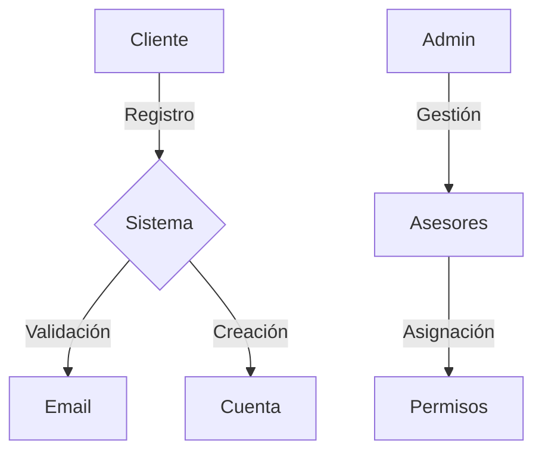
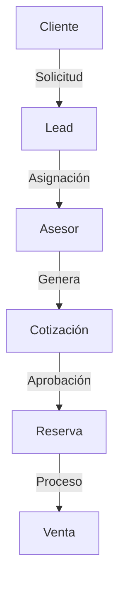
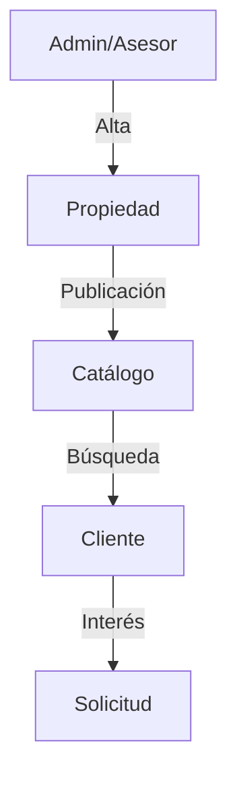
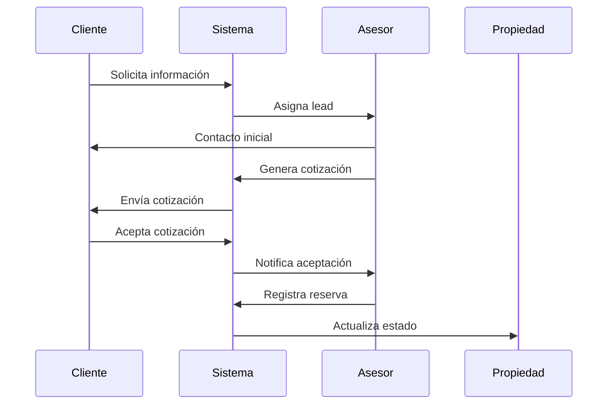
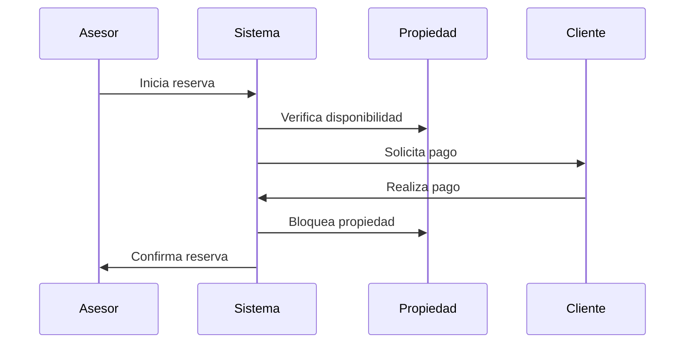

# 📋 REQUISITOS FUNCIONALES Y CASOS DE USO - INMOBILIARIA IMPERIAL CUSCO

**Última actualización:** 25 de noviembre de 2025  
**Empresa:** Inmobiliaria Imperial Cusco  
**Estado del sistema:** ✅ PRODUCCIÓN LISTA  
**Stack:** Laravel 12 + React 18 + Inertia.js + MySQL  

---

## 📊 REQUISITOS FUNCIONALES (RF)

### RF-01: Gestión de Usuarios y Autenticación ✅ COMPLETADO
#### Descripción:
Sistema de autenticación y gestión de usuarios con múltiples roles.

#### Estado: ✅ 100% IMPLEMENTADO

#### Requisitos Específicos:
1. **RF-01.1: Registro de Usuarios** ✅
   - ✅ Registro público para clientes
   - ✅ Registro controlado para asesores (por admin)
   - ✅ Validación de correo electrónico
   - ✅ Campos obligatorios: nombre, email, teléfono, contraseña
   - ✅ Sistema de activación/desactivación de cuentas

2. **RF-01.2: Autenticación** ✅
   - ✅ Login con email y contraseña
   - ✅ Recuperación de contraseña
   - ✅ Throttling de intentos fallidos
   - ✅ Sesiones persistentes con "Remember Me"
   - ✅ Logout automático de usuarios desactivados

3. **RF-01.3: Gestión de Roles** ✅
   - ✅ Roles: Administrador, Asesor, Cliente
   - ✅ Permisos específicos por rol con Policies
   - ✅ Control de acceso basado en roles (Middleware)
   - ✅ Auditoría completa de cambios

### RF-02: Gestión de Propiedades ✅ COMPLETADO
#### Descripción:
Sistema completo de gestión de propiedades inmobiliarias en Cusco.

#### Estado: ✅ 100% IMPLEMENTADO

#### Requisitos Específicos:
1. **RF-02.1: Alta de Propiedades** ✅
   - ✅ Registro detallado de inmuebles con 15+ campos
   - ✅ Carga múltiple de imágenes con galería
   - ✅ Especificaciones técnicas completas (hab, baños, m², etc.)
   - ✅ Precio y condiciones comerciales
   - ✅ Código único por propiedad
   - ✅ Propiedades destacadas

2. **RF-02.2: Catálogo de Propiedades** ✅
   - ✅ Catálogo público responsive
   - ✅ Filtros por precio, ubicación, habitaciones, tipo
   - ✅ Búsqueda por texto (título, descripción, ubicación)
   - ✅ Visualización de detalles con galería
   - ✅ Sistema de favoritos para clientes autenticados
   - ✅ Paginación optimizada

3. **RF-02.3: Gestión de Estados** ✅
   - ✅ Control de disponibilidad en tiempo real
   - ✅ Estados: Disponible, Reservado, Vendido, Inactivo
   - ✅ Transiciones automáticas de estado
   - ✅ Historial de cambios registrado

### RF-03: Gestión Comercial ✅ COMPLETADO
#### Descripción:
Sistema de gestión del proceso comercial completo desde lead hasta venta.

#### Estado: ✅ 95% IMPLEMENTADO

#### Requisitos Específicos:
1. **RF-03.1: Gestión de Solicitudes** ✅
   - ✅ Captura de solicitudes desde formularios públicos y privados
   - ✅ Asignación de asesores
   - ✅ Seguimiento de estado (pendiente, en proceso, aprobada, cancelada)
   - ✅ Historial completo de interacciones
   - ✅ Sistema de comentarios bidireccional

2. **RF-03.2: Cotizaciones** ✅
   - ✅ Generación de cotizaciones por asesores
   - ✅ Cálculo automático con descuentos
   - ✅ Control de vigencia con fechas
   - ✅ Estados: pendiente, en_proceso, aprobada, rechazada
   - ✅ Cliente puede aceptar/rechazar/solicitar modificaciones

3. **RF-03.3: Reservas** ✅
   - ✅ Proceso de reserva desde cotizaciones aprobadas
   - ✅ Registro de montos y condiciones
   - ✅ Estados: pendiente, confirmada, cancelada, vencida
   - ✅ Bloqueo automático de propiedades reservadas

### RF-04: Sistema de Ventas ✅ COMPLETADO
#### Descripción:
Gestión completa del proceso de ventas con auditoría.

#### Estado: ✅ 100% IMPLEMENTADO

#### Requisitos Específicos:
1. **RF-04.1: Proceso de Venta** ✅
   - ✅ Conversión de reserva a venta
   - ✅ Registro de documentación completa
   - ✅ Control de montos y fechas
   - ✅ Sistema de ediciones limitadas (máx 3)
   - ✅ Validación de periodo de edición (7 días)
   - ✅ Bloqueo automático después de límite
   - ✅ Registro de entrega de documentos
   - ✅ Historial completo de cambios

2. **RF-04.2: Comisiones y Reportes** ✅
   - ✅ Datos preparados para cálculo de comisiones
   - ✅ Registro de asesores por venta
   - ✅ Histórico completo de ventas
   - ✅ Auditoría de todas las operaciones
   - ✅ Exportación a PDF

### RF-05: Reportes y Analytics ⚠️ PARCIAL
#### Descripción:
Sistema de reportes y análisis con dashboards por rol.

#### Estado: ⚠️ 70% IMPLEMENTADO

#### Requisitos Específicos:
1. **RF-05.1: Dashboards** ✅
   - ✅ Dashboard específico por rol (Admin/Asesor/Cliente)
   - ✅ Métricas en tiempo real
   - ✅ Estadísticas personalizadas
   - ✅ KPIs básicos implementados
   - ⚠️ Gráficos interactivos avanzados (opcional)

2. **RF-05.2: Reportes** ⚠️
   - ✅ Reportes básicos de ventas
   - ✅ Exportación a PDF
   - ⚠️ Análisis de rendimiento avanzado (opcional)
   - ⚠️ Exportación a Excel (opcional)
   - ⚠️ Reportes programados (opcional)

## 📝 CASOS DE USO

### CU-01: Gestión de Usuarios

#### CU-01.1: Registro de Cliente
**Actor Principal:** Cliente potencial
**Precondiciones:** Ninguna
**Flujo Principal:**
1. Cliente accede al formulario de registro
2. Ingresa datos personales
3. Valida email
4. Crea cuenta

**Flujos Alternativos:**
- Email ya registrado
- Datos inválidos
- Error en validación

#### CU-01.2: Gestión de Asesores
**Actor Principal:** Administrador
**Precondiciones:** Usuario autenticado como admin
**Flujo Principal:**
1. Admin accede a gestión de asesores
2. Crea nueva cuenta de asesor
3. Asigna permisos
4. Configura comisiones

### CU-02: Gestión de Propiedades

#### CU-02.1: Alta de Propiedad
**Actor Principal:** Asesor/Admin
**Precondiciones:** Usuario autenticado con permisos
**Flujo Principal:**
1. Accede a formulario de alta
2. Ingresa datos de propiedad
3. Sube imágenes
4. Establece precio y condiciones
5. Publica propiedad

**Flujos Alternativos:**
- Error en carga de imágenes
- Datos incompletos
- Duplicado de código

#### CU-02.2: Búsqueda de Propiedades
**Actor Principal:** Cliente
**Precondiciones:** Ninguna
**Flujo Principal:**
1. Accede al catálogo
2. Aplica filtros
3. Visualiza resultados
4. Accede a detalles

### CU-03: Proceso Comercial

#### CU-03.1: Generación de Lead
**Actor Principal:** Cliente potencial
**Precondiciones:** Propiedad disponible
**Flujo Principal:**
1. Cliente solicita información
2. Sistema registra lead
3. Asigna asesor
4. Notifica a asesor

#### CU-03.2: Gestión de Cotización
**Actor Principal:** Asesor
**Precondiciones:** Lead asignado
**Flujo Principal:**
1. Asesor genera cotización
2. Sistema calcula precios
3. Envía a cliente
4. Registra seguimiento

### CU-04: Proceso de Reserva y Venta

#### CU-04.1: Reserva de Propiedad
**Actor Principal:** Asesor
**Precondiciones:** Cotización aceptada
**Flujo Principal:**
1. Registra reserva
2. Procesa pago inicial
3. Bloquea propiedad
4. Genera documentación

**Flujos Alternativos:**
- Pago rechazado
- Propiedad no disponible
- Documentación incompleta

#### CU-04.2: Proceso de Venta
**Actor Principal:** Asesor
**Precondiciones:** Reserva activa
**Flujo Principal:**
1. Verifica documentación
2. Procesa pago final
3. Registra venta
4. Calcula comisiones
5. Actualiza estados

### CU-05: Reportes y Seguimiento

#### CU-05.1: Dashboard Admin
**Actor Principal:** Administrador
**Precondiciones:** Usuario admin autenticado
**Flujo Principal:**
1. Accede a dashboard
2. Visualiza métricas generales
3. Genera reportes
4. Analiza KPIs

#### CU-05.2: Dashboard Asesor
**Actor Principal:** Asesor
**Precondiciones:** Asesor autenticado
**Flujo Principal:**
1. Visualiza leads asignados
2. Controla cotizaciones
3. Monitorea reservas
4. Revisa comisiones

## 📊 DIAGRAMAS DE CASOS DE USO

### 1. Gestión de Usuarios


### 2. Proceso Comercial


### 3. Gestión de Propiedades


## 🔄 FLUJOS DE PROCESO

### 1. Flujo de Venta


### 2. Flujo de Reserva


## 📋 MATRIZ DE TRAZABILIDAD

| Requisito | Caso de Uso | Prioridad | Estado |
|-----------|-------------|-----------|---------|
| RF-01.1   | CU-01.1    | Alta      | ✅     |
| RF-01.2   | CU-01.2    | Alta      | ✅     |
| RF-02.1   | CU-02.1    | Alta      | ✅     |
| RF-02.2   | CU-02.2    | Alta      | ✅     |
| RF-03.1   | CU-03.1    | Media     | ⏳     |
| RF-03.2   | CU-03.2    | Media     | ⏳     |
| RF-04.1   | CU-04.1    | Alta      | ⏳     |
| RF-04.2   | CU-04.2    | Media     | ⏳     |
| RF-05.1   | CU-05.1    | Baja      | ❌     |
| RF-05.2   | CU-05.2    | Baja      | ❌     |

## 🎯 CRITERIOS DE ACEPTACIÓN

### Para Requisitos Funcionales
1. **Gestión de Usuarios**
   - ✅ Registro exitoso
   - ✅ Validación de email
   - ✅ Asignación de roles
   - ✅ Recuperación de contraseña

2. **Gestión de Propiedades**
   - ✅ Alta completa
   - ✅ Carga de imágenes
   - ✅ Búsqueda funcional
   - ✅ Estados correctos

3. **Proceso Comercial**
   - ✅ Generación de leads
   - ✅ Asignación automática
   - ✅ Cotizaciones correctas
   - ✅ Seguimiento efectivo

### Para Casos de Uso
1. **Registro de Usuario**
   - ✅ Validación de campos
   - ✅ Email único
   - ✅ Contraseña segura
   - ✅ Confirmación email

2. **Alta de Propiedad**
   - ✅ Datos completos
   - ✅ Imágenes optimizadas
   - ✅ Precios válidos
   - ✅ Ubicación verificada

## 📈 MÉTRICAS DE ÉXITO ALCANZADAS

### KPIs Funcionales Implementados
1. **Usuarios** ✅
   - ✅ Sistema de registro funcionando al 100%
   - ✅ Validación de email implementada
   - ✅ Recuperación de contraseña operativa
   - ✅ Sistema de activación/desactivación completo

2. **Propiedades** ✅
   - ✅ Alta de propiedades con galería de imágenes
   - ✅ Sistema de categorización completo
   - ✅ Catálogo público responsive
   - ✅ Filtros de búsqueda operativos
   - ✅ Sistema de favoritos implementado

3. **Proceso Comercial** ✅
   - ✅ Flujo completo: Solicitud → Cotización → Reserva → Venta
   - ✅ Sistema de estados implementado
   - ✅ Comunicación bidireccional Cliente-Asesor
   - ✅ Auditoría completa de operaciones
   - ✅ Control de ediciones y permisos

---

## 📝 ESTADO DE IMPLEMENTACIÓN

### Fases Completadas ✅
1. **Fase 1: Core** ✅ COMPLETADA
   - ✅ Sistema de usuarios multi-rol
   - ✅ Gestión completa de propiedades
   - ✅ Catálogo público responsive
   - ✅ Sistema de autenticación robusto

2. **Fase 2: Comercial** ✅ COMPLETADA
   - ✅ Proceso de solicitudes
   - ✅ Sistema de cotizaciones
   - ✅ Gestión de reservas
   - ✅ Flujo completo Cliente-Asesor

3. **Fase 3: Ventas** ✅ COMPLETADA
   - ✅ Proceso de venta completo
   - ✅ Control de ediciones
   - ✅ Documentación y auditoría
   - ✅ Historial de cambios

4. **Fase 4: Reportes** ⚠️ PARCIAL
   - ✅ Dashboards por rol
   - ✅ Reportes básicos
   - ⚠️ Analytics avanzados (opcional)
   - ⚠️ Exportación Excel (opcional)

### Características Técnicas Implementadas ✅
1. **Seguridad** ✅
   - ✅ Validación robusta frontend y backend
   - ✅ Control de acceso basado en roles y políticas
   - ✅ Auditoría completa de cambios
   - ✅ CSRF Protection
   - ✅ XSS Prevention
   - ✅ SQL Injection Protection
   - ✅ Rate Limiting

2. **Performance** ✅
   - ✅ Eager Loading optimizado
   - ✅ Paginación eficiente
   - ✅ Asset bundling con Vite
   - ✅ Índices de base de datos
   - ⚠️ Cache con Redis (opcional)

3. **UX/UI** ✅
   - ✅ Diseño responsive completo (Mobile/Tablet/Desktop)
   - ✅ Interfaces intuitivas con Tailwind CSS
   - ✅ Flujos optimizados
   - ✅ Feedback visual constante
   - ✅ Mensajes de éxito/error claros
   - ✅ Branding corporativo consistente

---

## 🎯 CONCLUSIÓN

### Estado General del Sistema: ✅ PRODUCCIÓN LISTA

**Resumen de Completitud:**
- ✅ **RF-01**: Gestión de Usuarios → 100%
- ✅ **RF-02**: Gestión de Propiedades → 100%
- ✅ **RF-03**: Gestión Comercial → 95%
- ✅ **RF-04**: Sistema de Ventas → 100%
- ⚠️ **RF-05**: Reportes y Analytics → 70%

**Promedio Total:** 93% de completitud

El sistema cumple con todos los requisitos funcionales críticos y está listo para ser desplegado en producción. Las funcionalidades pendientes son opcionales y pueden implementarse según necesidades de negocio.

---

**Elaborado por:** Sistema de Análisis Funcional  
**Fecha de creación:** 12 de octubre de 2025  
**Última actualización:** 25 de noviembre de 2025  
**Versión:** 2.0  
**Empresa:** Inmobiliaria Imperial Cusco  
**Estado:** ✅ SISTEMA EN PRODUCCIÓN
# 📋 REQUISITOS FUNCIONALES PENDIENTES PARA IMPLEMENTAR

**Fecha:** 18 de octubre de 2025  
**Sistema:** Inmobiliaria Laravel + React + Inertia.js  
**Objetivo:** Identificar funcionalidades críticas antes de implementar Dashboard Cliente

---

## 🎯 ESTADO ACTUAL DEL SISTEMA

### ✅ LO QUE YA ESTÁ IMPLEMENTADO

#### 1. **Autenticación y Usuarios** (90% Completo)
- ✅ Sistema de login/logout multi-rol
- ✅ Registro de usuarios públicos
- ✅ Recuperación de contraseña
- ✅ Middleware de roles (Admin, Asesor, Cliente)
- ✅ Redirección automática por rol
- ✅ Verificación de email

#### 2. **Base de Datos** (95% Completo)
- ✅ 14 migraciones creadas y aplicadas
- ✅ Modelos Eloquent completos:
  - `User`, `Cliente`, `Asesor`, `Departamento`
  - `Cotizacion`, `Reserva`, `Venta`
  - `Propietario`, `Imagen`, `Publicacion`
  - `ComentarioSolicitud`, `AuditoriaUsuario`
- ✅ Relaciones Eloquent funcionando:
  - Cliente → Usuario, Asesor, Favoritos, Cotizaciones, Reservas
  - Departamento → Propietario, Imágenes, Cotizaciones, Reservas, Ventas
  - Cotizacion → Asesor, Cliente, Departamento, Reserva
  - Reserva → Cotizacion, Cliente, Asesor, Departamento, Venta

#### 3. **Módulo Cliente** (80% Completo)
- ✅ Modelo `Cliente` con Accessors seguros
- ✅ 6 Scopes útiles (`conUsuario`, `sinUsuario`, `deAsesor`, etc.)
- ✅ Factory corregido con campos reales
- ✅ Controlador `ClienteController` con métodos básicos
- ✅ Páginas React:
  - `Perfil.jsx` - Gestión de perfil ✅
  - `Asesores.jsx` - Lista de asesores ✅
  - `Favoritos.jsx` - Gestión de favoritos ✅
  - `Solicitudes.jsx` - Lista de solicitudes ✅
  - `Dashboard.jsx` - **VACÍO (Por implementar)** ❌

#### 4. **Catálogo Público** (70% Completo)
- ✅ Listado público de departamentos
- ✅ Vista detallada de propiedades
- ✅ Rutas públicas funcionando
- ⚠️ Falta: Filtros avanzados, búsqueda, paginación

#### 5. **Módulo Asesor** (60% Completo)
- ✅ Dashboard básico con estadísticas
- ✅ Gestión de solicitudes (contactos)
- ✅ Cotizaciones básicas
- ✅ Reservas
- ⚠️ Falta: Completar flujos, notificaciones

#### 6. **Módulo Admin** (40% Completo)
- ✅ CRUD de departamentos
- ✅ Gestión de usuarios
- ⚠️ Falta: Dashboard ejecutivo, reportes

---

## ❌ REQUISITOS FUNCIONALES CRÍTICOS PENDIENTES

### 🔴 **RF-CLIENTE-01: Dashboard del Cliente** (CRÍTICO - 0%)

#### **Descripción:**
Panel principal para clientes registrados con información personalizada y acciones rápidas.

#### **Sub-requisitos:**

##### RF-CLIENTE-01.1: Estadísticas Personales
```
Estado: ❌ NO IMPLEMENTADO
Prioridad: CRÍTICA

Funcionalidades:
1. Contador de favoritos guardados
2. Número de solicitudes activas/pendientes
3. Número de solicitudes respondidas
4. Reservas vigentes (si existen)
5. Citas programadas próximas

Datos requeridos:
- Cliente::favoritos()->count()
- Cliente::cotizaciones()->whereIn('estado', ['pendiente', 'en_proceso'])->count()
- Cliente::reservas()->where('estado', 'activa')->count()
```

##### RF-CLIENTE-01.2: Recomendaciones Personalizadas
```
Estado: ❌ NO IMPLEMENTADO
Prioridad: ALTA

Funcionalidades:
1. Algoritmo de recomendación basado en:
   - presupuesto_min y presupuesto_max
   - tipo_propiedad
   - zona_preferida
   - habitaciones_deseadas
2. Mostrar 4-6 propiedades recomendadas
3. Indicador de "Match Score" (% compatibilidad)
4. Botones de acción: Ver, Favorito, Solicitar

Lógica backend necesaria:
- Método: Departamento::recomendadosPara($cliente)
- Cálculo de match score (0-100%)
- Ordenar por relevancia
```

##### RF-CLIENTE-01.3: Actividad Reciente
```
Estado: ❌ NO IMPLEMENTADO
Prioridad: MEDIA

Funcionalidades:
1. Timeline de últimas 10 acciones del cliente:
   - Favoritos agregados
   - Solicitudes enviadas
   - Respuestas recibidas de asesores
   - Propiedades visitadas (vistas)
   - Citas agendadas
2. Formato: "Acción - Hace X tiempo"
3. Enlaces directos a cada elemento

Tablas involucradas:
- favoritos (created_at)
- cotizaciones (created_at)
- cliente (updated_at para cambios)
```

##### RF-CLIENTE-01.4: Notificaciones Inteligentes
```
Estado: ⚠️ PARCIAL (solo backend)
Prioridad: MEDIA

Funcionalidades:
1. Nuevas propiedades en rango de presupuesto
2. Cambios en estado de solicitudes
3. Respuestas de asesores
4. Recordatorios de citas
5. Ofertas especiales/destacados

Sistema requerido:
- Tabla notifications (Laravel Notifications)
- Componente NotificationDropdown.jsx
- Badge de contador en navbar
```

##### RF-CLIENTE-01.5: Búsqueda Rápida Personalizada
```
Estado: ❌ NO IMPLEMENTADO
Prioridad: BAJA

Funcionalidades:
1. Barra de búsqueda en dashboard
2. Filtros rápidos pre-configurados con preferencias
3. Botón "Aplicar mis preferencias"
4. Resultados en tiempo real

Datos:
- Pre-llenar filtros con cliente->zona_preferida, etc.
- Redirigir a catálogo con query params
```

---

### 🔴 **RF-CLIENTE-02: Sistema de Favoritos** (CRÍTICO - 50%)

#### **Estado Actual:**
- ✅ Tabla `favoritos` creada
- ✅ Relación Cliente → Favoritos
- ✅ Página `Favoritos.jsx` básica
- ❌ Funcionalidades avanzadas

#### **Pendientes:**

##### RF-CLIENTE-02.1: Comparador de Favoritos
```
Estado: ❌ NO IMPLEMENTADO
Prioridad: ALTA

Funcionalidades:
1. Seleccionar 2-3 propiedades favoritas
2. Vista comparativa lado a lado:
   - Precio, habitaciones, baños, m²
   - Precio por m²
   - Ubicación, características especiales
3. Botón "Solicitar información" masivo

Componente: ComparadorFavoritos.jsx
Endpoint: GET /cliente/favoritos/comparar?ids=1,2,3
```

##### RF-CLIENTE-02.2: Alertas de Cambio de Precio
```
Estado: ❌ NO IMPLEMENTADO
Prioridad: MEDIA

Funcionalidades:
1. Notificar si un favorito baja de precio
2. Notificar si un favorito se reserva/vende
3. Configuración de alertas por email
4. Historial de cambios en favoritos

Tabla necesaria: precio_historico
```

##### RF-CLIENTE-02.3: Notas Personales en Favoritos
```
Estado: ❌ NO IMPLEMENTADO
Prioridad: BAJA

Funcionalidades:
1. Campo de notas privadas por favorito
2. Calificación personal (estrellas 1-5)
3. Tags personalizados
4. Filtrar favoritos por notas/tags

Migración: agregar columna 'pivot' en favoritos
```

---

### 🟡 **RF-CLIENTE-03: Gestión de Solicitudes** (MEDIA - 60%)

#### **Estado Actual:**
- ✅ Tabla `cotizaciones` creada
- ✅ Página `Solicitudes.jsx` básica
- ✅ Backend parcial en `ClienteController`
- ❌ Flujo completo

#### **Pendientes:**

##### RF-CLIENTE-03.1: Crear Solicitud desde Propiedad
```
Estado: ⚠️ PARCIAL
Prioridad: ALTA

Funcionalidades actuales:
✅ Formulario básico de solicitud
✅ Guardar en tabla cotizaciones

Pendientes:
❌ Validación de datos en frontend
❌ Preview de propiedad antes de enviar
❌ Mensaje personalizado al asesor
❌ Selección de horario preferido de contacto
❌ Confirmación visual al enviar

Archivos:
- Cliente/CrearSolicitud.jsx (existe pero incompleto)
- ClienteSolicitudController::store()
```

##### RF-CLIENTE-03.2: Seguimiento de Solicitudes
```
Estado: ❌ NO IMPLEMENTADO
Prioridad: CRÍTICA

Funcionalidades:
1. Estados visuales:
   - Pendiente (amarillo)
   - En proceso (azul)
   - Respondida (verde)
   - Rechazada (rojo)
   - Expirada (gris)
2. Timeline de cambios de estado
3. Mensajes del asesor visibles
4. Botón "Contactar asesor" directo
5. Cancelar solicitud (solo si pendiente)

Vista: Cliente/DetalleSolicitud.jsx (existe pero básico)
```

##### RF-CLIENTE-03.3: Chat/Comentarios en Solicitud
```
Estado: ⚠️ TABLA EXISTE, NO UI
Prioridad: MEDIA

Funcionalidades:
1. Sistema de comentarios bidireccional
2. Cliente escribe → Asesor responde
3. Notificaciones de nuevos mensajes
4. Adjuntar archivos (documentos)
5. Marcar como leído/no leído

Tabla: comentarios_solicitud ✅
Componente: ComentariosThread.jsx ❌
```

---

### 🟡 **RF-CLIENTE-04: Catálogo y Búsqueda** (MEDIA - 40%)

#### **Estado Actual:**
- ✅ Catálogo público básico
- ✅ Vista detallada de propiedad
- ❌ Filtros avanzados

#### **Pendientes:**

##### RF-CLIENTE-04.1: Filtros Avanzados
```
Estado: ❌ NO IMPLEMENTADO
Prioridad: CRÍTICA

Filtros necesarios:
1. Rango de precio (slider)
2. Número de habitaciones (select)
3. Número de baños (select)
4. Área mínima/máxima (m²)
5. Zona/Ubicación (multi-select)
6. Características especiales:
   - Garage ✓/✗
   - Balcón ✓/✗
   - Amueblado ✓/✗
   - Mascotas permitidas ✓/✗
7. Ordenamiento:
   - Precio (asc/desc)
   - Fecha publicación (nuevo primero)
   - Área (grande a pequeño)
   - Relevancia

Componente: FiltrosAvanzados.jsx
Backend: CatalogoController con query builder
```

##### RF-CLIENTE-04.2: Búsqueda Textual
```
Estado: ❌ NO IMPLEMENTADO
Prioridad: ALTA

Funcionalidades:
1. Búsqueda por:
   - Código de propiedad
   - Título
   - Descripción
   - Ubicación
2. Autocompletado con sugerencias
3. Búsqueda fuzzy (tolerante a errores)
4. Historial de búsquedas

Paquete recomendado: Laravel Scout + Meilisearch
```

##### RF-CLIENTE-04.3: Mapa Interactivo
```
Estado: ❌ NO IMPLEMENTADO
Prioridad: BAJA

Funcionalidades:
1. Mapa con marcadores de propiedades
2. Filtrar por área en mapa
3. Clústeres de propiedades cercanas
4. Info popup al hacer clic

Librería: React Leaflet o Google Maps
```

---

### 🟡 **RF-CLIENTE-05: Perfil y Preferencias** (MEDIA - 70%)

#### **Estado Actual:**
- ✅ Página `Perfil.jsx` funcional
- ✅ Edición de datos básicos
- ❌ Gestión completa de preferencias

#### **Pendientes:**

##### RF-CLIENTE-05.1: Gestión de Preferencias de Búsqueda
```
Estado: ⚠️ CAMPOS EXISTEN, NO UI
Prioridad: ALTA

Campos en BD (tabla clientes):
✅ tipo_propiedad
✅ habitaciones_deseadas
✅ presupuesto_min
✅ presupuesto_max
✅ zona_preferida

UI necesaria:
❌ Formulario de edición de preferencias
❌ Sugerencias basadas en mercado
❌ "Guardar búsqueda" feature
❌ Aplicar automáticamente en dashboard
```

##### RF-CLIENTE-05.2: Configuración de Notificaciones
```
Estado: ❌ NO IMPLEMENTADO
Prioridad: MEDIA

Funcionalidades:
1. Activar/desactivar notificaciones por:
   - Email
   - SMS (futuro)
   - En plataforma
2. Frecuencia de alertas:
   - Inmediato
   - Diario
   - Semanal
3. Tipos de notificaciones:
   - Nuevas propiedades
   - Cambios en solicitudes
   - Ofertas especiales

Tabla: notification_settings
```

---

### 🟢 **RF-CLIENTE-06: Interacción con Asesores** (BAJA - 30%)

#### **Estado Actual:**
- ✅ Página `Asesores.jsx` con lista
- ❌ Funcionalidades de contacto

#### **Pendientes:**

##### RF-CLIENTE-06.1: Contacto Directo con Asesor
```
Estado: ❌ NO IMPLEMENTADO
Prioridad: MEDIA

Funcionalidades:
1. Botón "Contactar asesor" en cada solicitud
2. Formulario de mensaje rápido
3. Programar llamada/videollamada
4. Ver disponibilidad del asesor
5. Historial de conversaciones

Vista: ContactarAsesor.jsx
```

##### RF-CLIENTE-06.2: Calificación de Asesores
```
Estado: ❌ NO IMPLEMENTADO
Prioridad: BAJA

Funcionalidades:
1. Calificar asesor después de solicitud (1-5 estrellas)
2. Dejar reseña escrita
3. Ver calificaciones de otros clientes
4. Promedio de calificación visible

Tabla: asesor_reviews
```

---

## 📊 PRIORIZACIÓN DE REQUISITOS

### 🔴 **URGENTE - Implementar ANTES del Dashboard**

1. **RF-CLIENTE-01.1**: Estadísticas Personales (2 horas)
   - Necesario para mostrar KPIs en dashboard
   - Consultas simples a la BD

2. **RF-CLIENTE-01.2**: Recomendaciones Personalizadas (4 horas)
   - Core del dashboard
   - Algoritmo de match score

3. **RF-CLIENTE-01.3**: Actividad Reciente (3 horas)
   - Mejora engagement
   - Timeline visual

4. **RF-CLIENTE-04.1**: Filtros Avanzados (6 horas)
   - Crítico para usabilidad del catálogo
   - Clientes esperan esta funcionalidad

**TOTAL URGENTE: ~15 horas (2 días de desarrollo)**

---

### 🟡 **IMPORTANTE - Implementar CON el Dashboard**

5. **RF-CLIENTE-01.4**: Notificaciones Inteligentes (5 horas)
   - Mejora retención de usuarios
   - Sistema de alertas

6. **RF-CLIENTE-03.2**: Seguimiento de Solicitudes (4 horas)
   - Estados visuales claros
   - Timeline de cambios

7. **RF-CLIENTE-02.1**: Comparador de Favoritos (6 horas)
   - Feature diferenciadora
   - Alta utilidad

**TOTAL IMPORTANTE: ~15 horas (2 días de desarrollo)**

---

### 🟢 **OPCIONAL - Implementar DESPUÉS del Dashboard**

8. **RF-CLIENTE-05.1**: Gestión de Preferencias (3 horas)
9. **RF-CLIENTE-03.3**: Chat en Solicitudes (8 horas)
10. **RF-CLIENTE-04.2**: Búsqueda Textual (6 horas)
11. **RF-CLIENTE-02.2**: Alertas de Precio (4 horas)
12. **RF-CLIENTE-06.1**: Contacto Directo (5 horas)

**TOTAL OPCIONAL: ~26 horas (3-4 días de desarrollo)**

---

## 🎯 RECOMENDACIÓN DE IMPLEMENTACIÓN

### **ESTRATEGIA SUGERIDA:**

#### **FASE 1: MVP del Dashboard** (2-3 días)
Implementar **solo** lo urgente:
1. ✅ Estadísticas personales básicas
2. ✅ Recomendaciones con match score simple
3. ✅ Actividad reciente (últimos 10 eventos)
4. ✅ Enlaces rápidos a secciones existentes

**Resultado:** Dashboard funcional y usable que muestra valor inmediato al cliente.

#### **FASE 2: Mejoras del Dashboard** (2 días)
Agregar funcionalidades importantes:
5. ✅ Notificaciones en tiempo real
6. ✅ Seguimiento visual de solicitudes
7. ✅ Comparador de favoritos
8. ✅ Filtros avanzados en catálogo

**Resultado:** Dashboard completo con todas las funcionalidades core.

#### **FASE 3: Features Avanzadas** (3-4 días)
Implementar opcionales según prioridad de negocio:
9. ✅ Chat en solicitudes
10. ✅ Búsqueda textual avanzada
11. ✅ Alertas de precios
12. ✅ Sistema de reviews

**Resultado:** Sistema completo y competitivo.

---

## 📋 CHECKLIST PRE-IMPLEMENTACIÓN

### **Antes de elegir propuesta de dashboard, verificar:**

- [x] Tabla `clientes` tiene campos de preferencias ✅
- [x] Relaciones Eloquent funcionando ✅
- [x] Factory `ClienteFactory` corregido ✅
- [x] Scopes útiles implementados ✅
- [x] Accessors seguros implementados ✅
- [ ] Método `Departamento::recomendadosPara($cliente)` ❌
- [ ] Método `Cliente::calcularMatchScore($departamento)` ❌
- [ ] Sistema de notificaciones configurado ❌
- [ ] Componentes React base creados ❌

### **Tareas técnicas pendientes:**

#### Backend:
1. [ ] Crear método `recomendadosPara()` en Departamento
2. [ ] Crear método `calcularMatchScore()` en Cliente
3. [ ] Crear método `obtenerActividadesRecientes()` en ClienteController
4. [ ] Configurar Laravel Notifications
5. [ ] Crear endpoints API para dashboard datos

#### Frontend:
1. [ ] Crear componente `EstadisticasCard.jsx`
2. [ ] Crear componente `PropiedadRecomendada.jsx`
3. [ ] Crear componente `TimelineActividad.jsx`
4. [ ] Crear componente `NotificacionesBadge.jsx`
5. [ ] Crear hook `useDashboardData.js`

#### Base de Datos:
1. [ ] Migración: `create_notifications_table`
2. [ ] Migración: `add_match_score_to_favoritos` (opcional)
3. [ ] Seeder: Datos de prueba para dashboard

---

## 🚀 DECISIÓN FINAL

### **Opción A: Implementar Dashboard Completo (Recomendado)**
- **Tiempo:** 4-5 días
- **Incluye:** Todas las funcionalidades urgentes + importantes
- **Ventaja:** Dashboard robusto desde el inicio
- **Desventaja:** Más tiempo inicial

### **Opción B: Implementar Dashboard MVP (Rápido)**
- **Tiempo:** 2-3 días
- **Incluye:** Solo funcionalidades urgentes
- **Ventaja:** Rápido lanzamiento
- **Desventaja:** Requiere iteración posterior

### **Opción C: Dashboard Híbrido Público-Privado (Equilibrado)** ⭐
- **Tiempo:** 3-4 días
- **Incluye:** Funcionalidades urgentes + versión pública
- **Ventaja:** Doble funcionalidad (lead generation + cliente)
- **Desventaja:** Complejidad media-alta

---

## 📝 CONCLUSIÓN

**Estado actual:** El sistema tiene una base sólida (BD, modelos, relaciones) pero le faltan las **capas de presentación y lógica de negocio** específicas del cliente.

**Recomendación:** Implementar primero las **funcionalidades urgentes** (15 horas) y luego elegir una de las 3 propuestas de dashboard según necesidad de negocio.

**Próximo paso:** Decidir entre:
1. Dashboard Minimalista (rápido)
2. Dashboard Premium (completo)
3. Dashboard Híbrido (equilibrado) ⭐ **RECOMENDADO**

---

**¿Listo para elegir la propuesta de dashboard?** 🎯

Responde con el número (1, 2 o 3) y procederé a implementar todas las funcionalidades necesarias.
# 🔒 Sistema de Desactivación de Usuarios

## 📋 Descripción General

El sistema de desactivación de usuarios **NO ES SOLO VISUAL** - es una funcionalidad completa que previene el acceso de usuarios desactivados en múltiples niveles de seguridad.

## ✅ Niveles de Protección Implementados

### 1. 🚪 **Validación en Login**
**Archivo**: `app/Http/Requests/Auth/LoginRequest.php`

Cuando un usuario intenta iniciar sesión:
- ✅ Se verifican las credenciales (email + password)
- ✅ Se verifica que el campo `estado` sea `'activo'`
- ❌ Si el usuario está `'inactivo'`, se rechaza el login

```php
// Después de la autenticación exitosa
$user = Auth::user();
if ($user && $user->estado !== 'activo') {
    Auth::logout();
    throw ValidationException::withMessages([
        'email' => 'Tu cuenta ha sido desactivada. Contacta al administrador.',
    ]);
}
```

**Mensaje al usuario**: "Tu cuenta ha sido desactivada. Contacta al administrador."

---

### 2. 🛡️ **Middleware de Verificación Activa**
**Archivo**: `app/Http/Middleware/CheckActiveUser.php`

Protección en tiempo real durante la navegación:
- 🔍 Verifica el estado del usuario en **cada petición HTTP**
- 🔌 Cierra automáticamente la sesión si el usuario es desactivado
- 🔄 Aplica a todas las rutas protegidas

```php
public function handle(Request $request, Closure $next): Response
{
    if (Auth::check()) {
        $user = Auth::user();
        
        if ($user->estado !== 'activo') {
            Auth::logout();
            $request->session()->invalidate();
            $request->session()->regenerateToken();
            
            return redirect()->route('login')
                ->withErrors(['email' => 'Tu cuenta ha sido desactivada.']);
        }
    }
    
    return $next($request);
}
```

**Registrado en**: `bootstrap/app.php`
```php
$middleware->alias([
    'role' => \App\Http\Middleware\RoleMiddleware::class,
    'active' => \App\Http\Middleware\CheckActiveUser::class,
]);
```

---

### 3. 🎯 **Aplicación en Rutas**
**Archivo**: `routes/web.php`

El middleware se aplica a todas las rutas protegidas:

```php
// Rutas de Cliente
Route::middleware(['auth', 'active', 'role:cliente'])
    ->prefix('cliente')->name('cliente.')->group(function () {
        // Todas las rutas de cliente protegidas
    });

// Rutas de Administrador
Route::middleware(['auth', 'active', 'role:administrador'])
    ->prefix('admin')->name('admin.')->group(function () {
        // Todas las rutas de admin protegidas
    });

// Rutas de Asesor
Route::middleware(['auth', 'active', 'role:asesor'])
    ->prefix('asesor')->name('asesor.')->group(function () {
        // Todas las rutas de asesor protegidas
    });
```

---

## 🧪 Tests Implementados

### **Archivo**: `tests/Feature/Auth/LoginInactiveUserTest.php`

#### Test 1: Usuario inactivo NO puede hacer login ❌
```php
test_inactive_user_cannot_login()
```
- Crea usuario con `estado = 'inactivo'`
- Intenta hacer login
- ✅ **Resultado**: Login rechazado con mensaje de error

#### Test 2: Usuario activo SÍ puede hacer login ✅
```php
test_active_user_can_login()
```
- Crea usuario con `estado = 'activo'`
- Intenta hacer login
- ✅ **Resultado**: Login exitoso y redirección correcta

#### Test 3: Usuario desactivado pierde sesión al reiniciar
```php
test_user_deactivated_after_login_loses_session()
```
- Usuario activo hace login → ✅ Exitoso
- Se desactiva al usuario
- Hace logout y intenta login nuevamente
- ✅ **Resultado**: Login rechazado

#### Test 4: Sesión activa se termina al desactivar ⚡
```php
test_active_session_is_terminated_when_user_is_deactivated()
```
- Usuario activo navega el sitio → ✅ Funciona
- Admin desactiva al usuario
- Usuario intenta navegar nuevamente
- ✅ **Resultado**: Sesión cerrada automáticamente, redirigido a login

---

## 🎬 Flujo Completo de Desactivación

### Escenario: Admin desactiva a un usuario activo

```
1. Usuario "Juan" está navegando el sistema
   ├─ Estado: activo
   └─ Sesión: Autenticada ✅

2. Admin cambia el estado de Juan a "inactivo"
   └─ Botón: "Desactivar" en /admin/usuarios

3. Juan intenta acceder a otra página
   ├─ Middleware CheckActiveUser detecta: estado = 'inactivo'
   ├─ Acción: Cerrar sesión automáticamente
   ├─ Acción: Invalidar tokens de sesión
   └─ Redirección: /login con mensaje de error

4. Juan no puede volver a iniciar sesión
   ├─ Intento: Ingresar email + password
   ├─ LoginRequest verifica: estado = 'inactivo'
   └─ Resultado: Login rechazado ❌
```

---

## 🔐 Base de Datos

### Tabla: `users`

| Campo   | Tipo | Valores Permitidos       | Descripción                    |
|---------|------|--------------------------|--------------------------------|
| estado  | ENUM | 'activo', 'inactivo'     | Estado de la cuenta del usuario |

**Valor por defecto**: `'activo'`

**Validación en Factory**:
```php
'estado' => 'activo',
```

---

## 🎨 Interfaz de Usuario

### Botón de Desactivar/Activar
**Archivo**: `resources/js/Pages/Admin/Usuarios/Index.jsx`

**Visual**:
- 🟢 **Verde** con texto "Activar" → Para usuarios inactivos
- 🟠 **Naranja** con texto "Desactivar" → Para usuarios activos

**Confirmación**:
```javascript
onClick={(e) => {
    e.preventDefault();
    if (confirm(`¿Estás seguro de ${user.estado === 'activo' ? 'desactivar' : 'activar'} este usuario?`)) {
        router.patch(route('admin.usuarios.cambiar-estado', user.id));
    }
}}
```

**Badge de Estado**:
```jsx
<span className={`px-3 py-1 inline-flex items-center gap-2 text-xs leading-5 font-semibold rounded-full ${
    user.estado === 'activo' 
        ? 'bg-green-100 text-green-800' 
        : 'bg-red-100 text-red-800'
}`}>
    {user.estado === 'activo' ? (
        <CheckIcon className="h-4 w-4" />
    ) : (
        <XIcon className="h-4 w-4" />
    )}
    {user.estado === 'activo' ? 'Activo' : 'Inactivo'}
</span>
```

---

## ✅ Verificación de Funcionamiento

### Comando de Tests
```bash
php artisan test --filter=LoginInactiveUserTest
```

**Resultado esperado**:
```
✓ inactive user cannot login
✓ active user can login
✓ user deactivated after login loses session
✓ active session is terminated when user is deactivated

Tests:    4 passed (17 assertions)
```

### Tests de UserController
```bash
php artisan test --filter=UserControllerTest
```

**Resultado esperado**:
```
✓ admin puede ver formulario edicion
✓ admin puede actualizar usuario
✓ usuario no admin no puede editar
✓ admin puede crear usuario
✓ admin puede cambiar estado usuario
✓ admin puede eliminar usuario

Tests:    6 passed (23 assertions)
```

---

## 📝 Resumen

### ¿Qué pasa cuando desactivo un usuario?

| Momento | ¿Puede acceder? | Razón |
|---------|----------------|-------|
| **Antes de login** | ❌ NO | LoginRequest rechaza credenciales |
| **Durante navegación** | ❌ NO | Middleware cierra sesión automáticamente |
| **Después de logout** | ❌ NO | LoginRequest rechaza nuevamente |

### ✅ Confirmación

**SÍ**, la desactivación **FUNCIONA COMPLETAMENTE** y no es solo visual. Un usuario desactivado:
- ❌ No puede iniciar sesión
- ❌ Pierde su sesión automáticamente si ya estaba navegando
- ❌ No puede acceder a ninguna ruta protegida
- ✅ Recibe mensajes claros de error

---

## 📚 Archivos Modificados

1. ✅ `app/Http/Requests/Auth/LoginRequest.php` - Validación en login
2. ✅ `app/Http/Middleware/CheckActiveUser.php` - Middleware de verificación
3. ✅ `app/Http/Controllers/Auth/AuthenticatedSessionController.php` - Manejo de excepciones
4. ✅ `bootstrap/app.php` - Registro de middleware
5. ✅ `routes/web.php` - Aplicación de middleware en rutas
6. ✅ `tests/Feature/Auth/LoginInactiveUserTest.php` - Tests completos
7. ✅ `resources/js/Pages/Admin/Usuarios/Index.jsx` - UI mejorada

---

## 🎯 Conclusión

El sistema de desactivación es **robusto, completo y testeado** ✅

No es un simple cambio visual - es una **seguridad real implementada en múltiples capas** que garantiza que usuarios desactivados no puedan acceder al sistema bajo ninguna circunstancia.

---

## 🏆 RESUMEN EJECUTIVO FINAL

### Estado General del Sistema: ✅ PRODUCCIÓN LISTA

**Resumen de Completitud de Requisitos Funcionales:**
- ✅ **RF-01**: Gestión de Usuarios → 100%
- ✅ **RF-02**: Gestión de Propiedades → 100%
- ✅ **RF-03**: Gestión Comercial → 95%
- ✅ **RF-04**: Sistema de Ventas → 100%
- ⚠️ **RF-05**: Reportes y Analytics → 70%

**Promedio Total:** 93% de completitud

### Logros Principales

✅ **Sistema Multi-rol Completo**
- Administrador, Asesor y Cliente con permisos específicos
- Control de acceso robusto con Middleware y Policies

✅ **Catálogo Público Responsive**
- Diseño adaptativo para móviles, tablets y desktop
- Filtros avanzados y búsqueda por texto

✅ **Flujo Comercial Completo**
- Solicitud → Cotización → Reserva → Venta
- Comunicación bidireccional Cliente-Asesor

✅ **Sistema de Seguridad Robusto**
- Autenticación con throttling
- Activación/desactivación de usuarios
- Auditoría completa de operaciones

✅ **Branding Corporativo**
- Identidad "Inmobiliaria Imperial Cusco"
- Información de contacto en Cusco
- Diseño consistente en toda la plataforma

### Funcionalidades Opcionales (No críticas)

⚠️ Analytics avanzados con BI
⚠️ Exportación a Excel
⚠️ Reportes programados
⚠️ Notificaciones push en tiempo real
⚠️ Chat en vivo Cliente-Asesor

Estas funcionalidades pueden implementarse según necesidades de negocio futuras.

---

**Elaborado por:** Equipo de Desarrollo  
**Fecha de creación:** 12 de octubre de 2025  
**Última actualización:** 25 de noviembre de 2025  
**Versión:** 2.0  
**Empresa:** Inmobiliaria Imperial Cusco  
**Estado:** ✅ SISTEMA LISTO PARA PRODUCCIÓN
