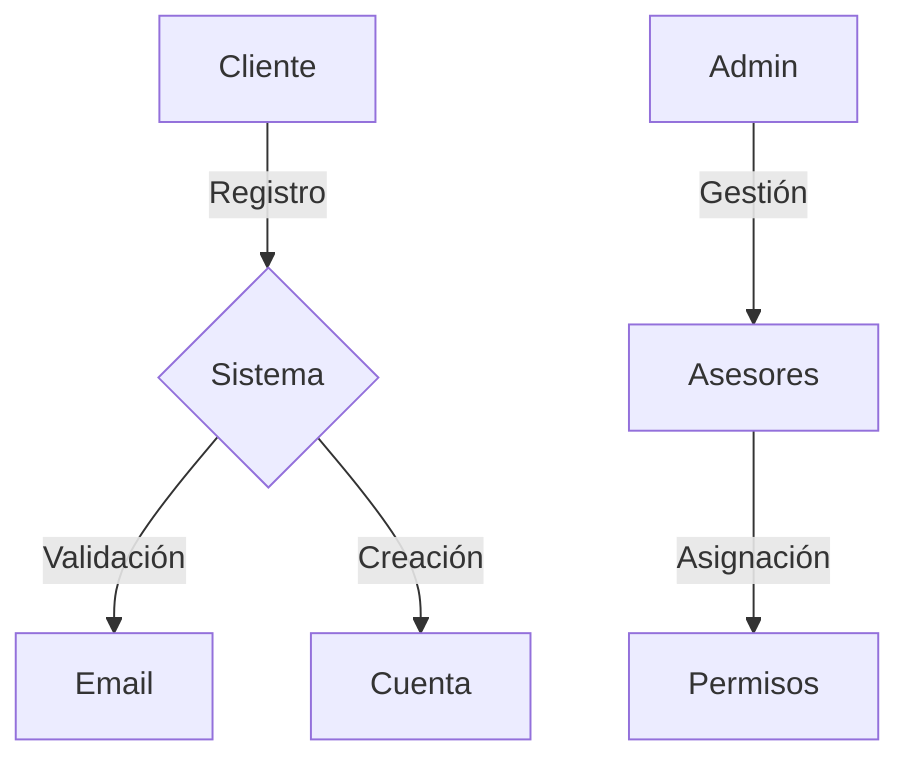
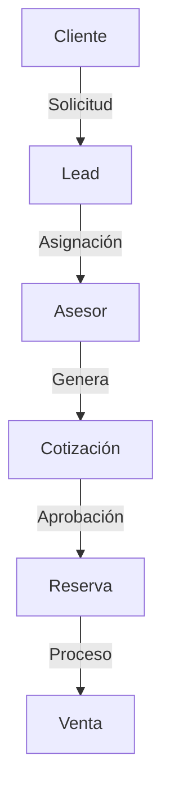
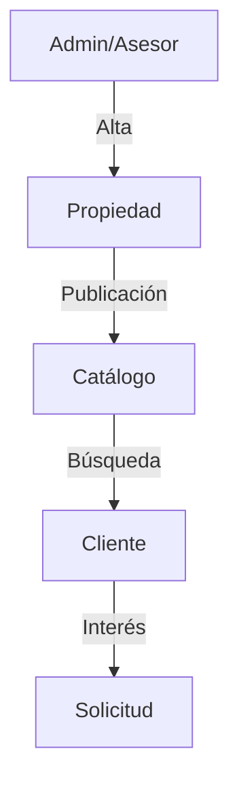
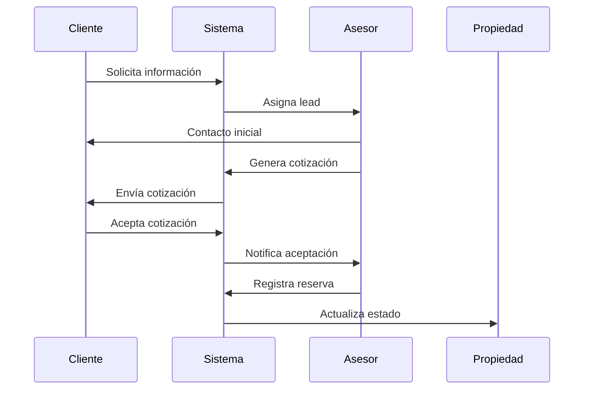
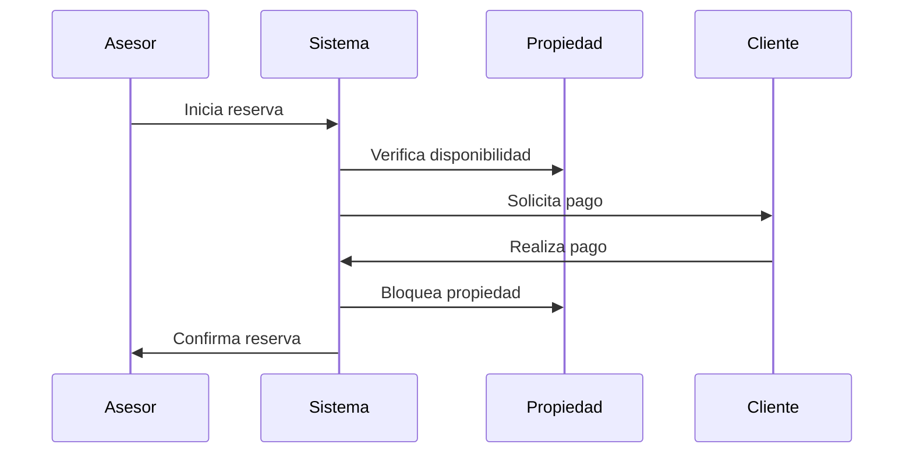

# 📋 REQUISITOS FUNCIONALES Y CASOS DE USO - SISTEMA INMOBILIARIO

## 📊 REQUISITOS FUNCIONALES (RF)

### RF-01: Gestión de Usuarios y Autenticación
#### Descripción:
Sistema de autenticación y gestión de usuarios con múltiples roles.

#### Requisitos Específicos:
1. **RF-01.1: Registro de Usuarios**
   - Registro público para clientes
   - Registro controlado para asesores (por admin)
   - Validación de correo electrónico
   - Campos obligatorios: nombre, email, teléfono, contraseña

2. **RF-01.2: Autenticación**
   - Login con email y contraseña
   - Recuperación de contraseña
   - Bloqueo tras intentos fallidos
   - Sesiones persistentes opcionales

3. **RF-01.3: Gestión de Roles**
   - Roles: Administrador, Asesor, Cliente
   - Permisos específicos por rol
   - Control de acceso basado en roles
   - Auditoría de cambios de roles

### RF-02: Gestión de Propiedades
#### Descripción:
Sistema completo de gestión de propiedades inmobiliarias.

#### Requisitos Específicos:
1. **RF-02.1: Alta de Propiedades**
   - Registro detallado de inmuebles
   - Carga múltiple de imágenes
   - Especificaciones técnicas
   - Precio y condiciones comerciales

2. **RF-02.2: Catálogo de Propiedades**
   - Listado público de propiedades
   - Filtros avanzados de búsqueda
   - Visualización de detalles
   - Sistema de favoritos

3. **RF-02.3: Gestión de Estados**
   - Control de disponibilidad
   - Estados: Disponible, Reservado, Vendido
   - Historial de cambios de estado
   - Notificaciones automáticas

### RF-03: Gestión Comercial
#### Descripción:
Sistema de gestión del proceso comercial completo.

#### Requisitos Específicos:
1. **RF-03.1: Gestión de Leads**
   - Captura de leads desde formularios
   - Asignación automática a asesores
   - Seguimiento de estado de leads
   - Historial de interacciones

2. **RF-03.2: Cotizaciones**
   - Generación de cotizaciones
   - Cálculo automático de precios
   - Control de vigencia
   - Estados de cotización

3. **RF-03.3: Reservas**
   - Proceso de reserva de propiedades
   - Gestión de pagos de reserva
   - Control de vencimientos
   - Cancelación automática

### RF-04: Sistema de Ventas
#### Descripción:
Gestión completa del proceso de ventas.

#### Requisitos Específicos:
1. **RF-04.1: Proceso de Venta**
   - Conversión de reserva a venta
   - Registro de documentación
   - Control de pagos
   - Generación de contratos

2. **RF-04.2: Comisiones**
   - Cálculo automático de comisiones
   - Registro de pagos a asesores
   - Reportes de comisiones
   - Histórico de ventas

### RF-05: Reportes y Analytics
#### Descripción:
Sistema completo de reportes y análisis.

#### Requisitos Específicos:
1. **RF-05.1: Dashboards**
   - Dashboard específico por rol
   - Métricas en tiempo real
   - Gráficos interactivos
   - KPIs personalizados

2. **RF-05.2: Reportes**
   - Reportes de ventas
   - Análisis de rendimiento
   - Exportación en múltiples formatos
   - Programación de reportes

## 📝 CASOS DE USO

### CU-01: Gestión de Usuarios

#### CU-01.1: Registro de Cliente
**Actor Principal:** Cliente potencial
**Precondiciones:** Ninguna
**Flujo Principal:**
1. Cliente accede al formulario de registro
2. Ingresa datos personales
3. Valida email
4. Crea cuenta

**Flujos Alternativos:**
- Email ya registrado
- Datos inválidos
- Error en validación

#### CU-01.2: Gestión de Asesores
**Actor Principal:** Administrador
**Precondiciones:** Usuario autenticado como admin
**Flujo Principal:**
1. Admin accede a gestión de asesores
2. Crea nueva cuenta de asesor
3. Asigna permisos
4. Configura comisiones

### CU-02: Gestión de Propiedades

#### CU-02.1: Alta de Propiedad
**Actor Principal:** Asesor/Admin
**Precondiciones:** Usuario autenticado con permisos
**Flujo Principal:**
1. Accede a formulario de alta
2. Ingresa datos de propiedad
3. Sube imágenes
4. Establece precio y condiciones
5. Publica propiedad

**Flujos Alternativos:**
- Error en carga de imágenes
- Datos incompletos
- Duplicado de código

#### CU-02.2: Búsqueda de Propiedades
**Actor Principal:** Cliente
**Precondiciones:** Ninguna
**Flujo Principal:**
1. Accede al catálogo
2. Aplica filtros
3. Visualiza resultados
4. Accede a detalles

### CU-03: Proceso Comercial

#### CU-03.1: Generación de Lead
**Actor Principal:** Cliente potencial
**Precondiciones:** Propiedad disponible
**Flujo Principal:**
1. Cliente solicita información
2. Sistema registra lead
3. Asigna asesor
4. Notifica a asesor

#### CU-03.2: Gestión de Cotización
**Actor Principal:** Asesor
**Precondiciones:** Lead asignado
**Flujo Principal:**
1. Asesor genera cotización
2. Sistema calcula precios
3. Envía a cliente
4. Registra seguimiento

### CU-04: Proceso de Reserva y Venta

#### CU-04.1: Reserva de Propiedad
**Actor Principal:** Asesor
**Precondiciones:** Cotización aceptada
**Flujo Principal:**
1. Registra reserva
2. Procesa pago inicial
3. Bloquea propiedad
4. Genera documentación

**Flujos Alternativos:**
- Pago rechazado
- Propiedad no disponible
- Documentación incompleta

#### CU-04.2: Proceso de Venta
**Actor Principal:** Asesor
**Precondiciones:** Reserva activa
**Flujo Principal:**
1. Verifica documentación
2. Procesa pago final
3. Registra venta
4. Calcula comisiones
5. Actualiza estados

### CU-05: Reportes y Seguimiento

#### CU-05.1: Dashboard Admin
**Actor Principal:** Administrador
**Precondiciones:** Usuario admin autenticado
**Flujo Principal:**
1. Accede a dashboard
2. Visualiza métricas generales
3. Genera reportes
4. Analiza KPIs

#### CU-05.2: Dashboard Asesor
**Actor Principal:** Asesor
**Precondiciones:** Asesor autenticado
**Flujo Principal:**
1. Visualiza leads asignados
2. Controla cotizaciones
3. Monitorea reservas
4. Revisa comisiones

## 📊 DIAGRAMAS DE CASOS DE USO

### 1. Gestión de Usuarios

### 2. Proceso Comercial

### 3. Gestión de Propiedades

## 🔄 FLUJOS DE PROCESO

### 1. Flujo de Venta

### 2. Flujo de Reserva

## 📋 MATRIZ DE TRAZABILIDAD

| Requisito | Caso de Uso | Prioridad | Estado |
|-----------|-------------|-----------|---------|
| RF-01.1   | CU-01.1    | Alta      | ✅     |
| RF-01.2   | CU-01.2    | Alta      | ✅     |
| RF-02.1   | CU-02.1    | Alta      | ✅     |
| RF-02.2   | CU-02.2    | Alta      | ✅     |
| RF-03.1   | CU-03.1    | Media     | ⏳     |
| RF-03.2   | CU-03.2    | Media     | ⏳     |
| RF-04.1   | CU-04.1    | Alta      | ⏳     |
| RF-04.2   | CU-04.2    | Media     | ⏳     |
| RF-05.1   | CU-05.1    | Baja      | ❌     |
| RF-05.2   | CU-05.2    | Baja      | ❌     |

## 🎯 CRITERIOS DE ACEPTACIÓN

### Para Requisitos Funcionales
1. **Gestión de Usuarios**
   - ✅ Registro exitoso
   - ✅ Validación de email
   - ✅ Asignación de roles
   - ✅ Recuperación de contraseña

2. **Gestión de Propiedades**
   - ✅ Alta completa
   - ✅ Carga de imágenes
   - ✅ Búsqueda funcional
   - ✅ Estados correctos

3. **Proceso Comercial**
   - ✅ Generación de leads
   - ✅ Asignación automática
   - ✅ Cotizaciones correctas
   - ✅ Seguimiento efectivo

### Para Casos de Uso
1. **Registro de Usuario**
   - ✅ Validación de campos
   - ✅ Email único
   - ✅ Contraseña segura
   - ✅ Confirmación email

2. **Alta de Propiedad**
   - ✅ Datos completos
   - ✅ Imágenes optimizadas
   - ✅ Precios válidos
   - ✅ Ubicación verificada

## 📈 MÉTRICAS DE ÉXITO

### KPIs Funcionales
1. **Usuarios**
   - Tasa de registro exitoso > 90%
   - Tiempo de validación < 5 min
   - Tasa de recuperación > 95%

2. **Propiedades**
   - Tiempo de publicación < 10 min
   - Calidad de imágenes 100%
   - Precisión de datos > 95%

3. **Ventas**
   - Conversión de leads > 20%
   - Tiempo de cierre < 30 días
   - Satisfacción cliente > 90%

---

## 📝 NOTAS DE IMPLEMENTACIÓN

### Prioridades de Desarrollo
1. **Fase 1: Core (1-2 semanas)**
   - Sistema de usuarios
   - Gestión básica de propiedades
   - Catálogo público

2. **Fase 2: Comercial (2-3 semanas)**
   - Proceso de leads
   - Cotizaciones
   - Reservas

3. **Fase 3: Ventas (2 semanas)**
   - Proceso de venta
   - Comisiones
   - Documentación

4. **Fase 4: Reportes (1-2 semanas)**
   - Dashboards
   - Analytics
   - Exportación

### Consideraciones Técnicas
1. **Seguridad**
   - Validación robusta
   - Control de acceso
   - Auditoría de cambios

2. **Performance**
   - Optimización de imágenes
   - Caché de consultas
   - Paginación eficiente

3. **UX/UI**
   - Interfaces intuitivas
   - Flujos optimizados
   - Feedback constante

---

**Elaborado por:** Sistema de Análisis Funcional  
**Fecha:** 12 de Octubre, 2025  
**Versión:** 1.0